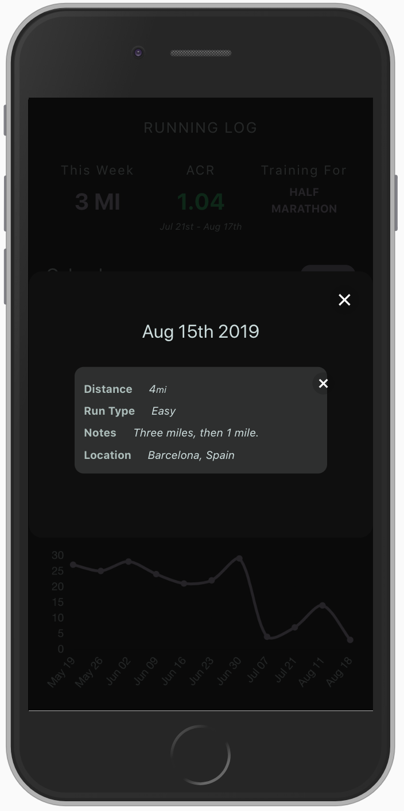
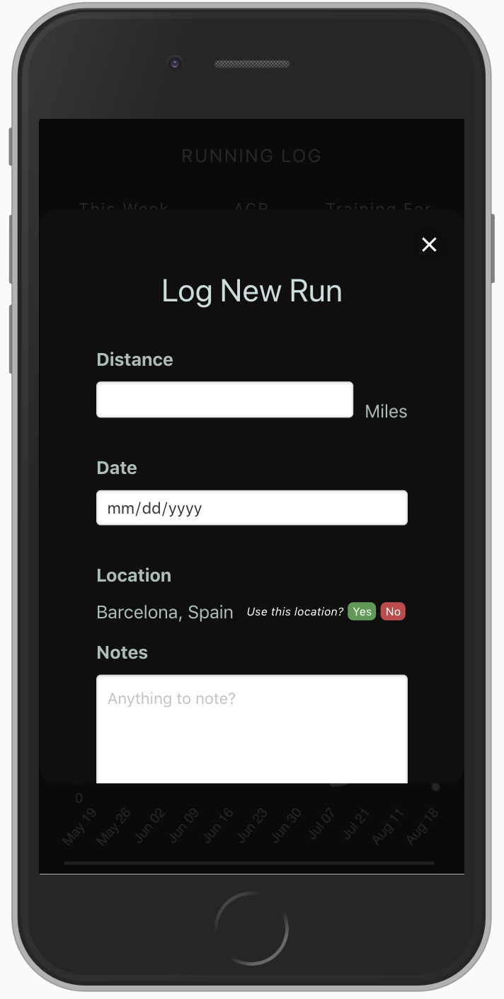
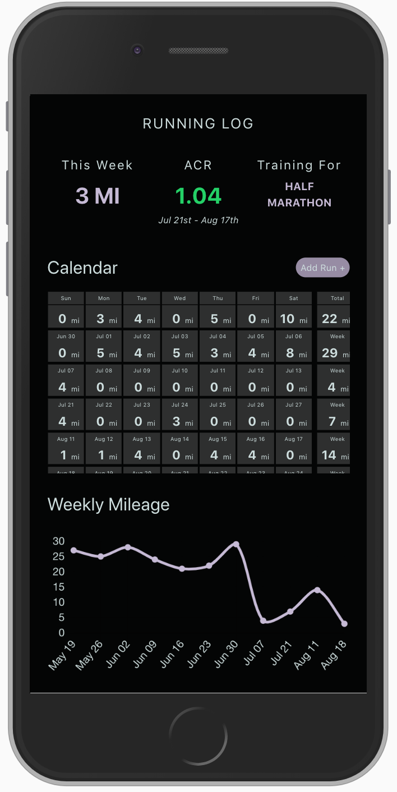
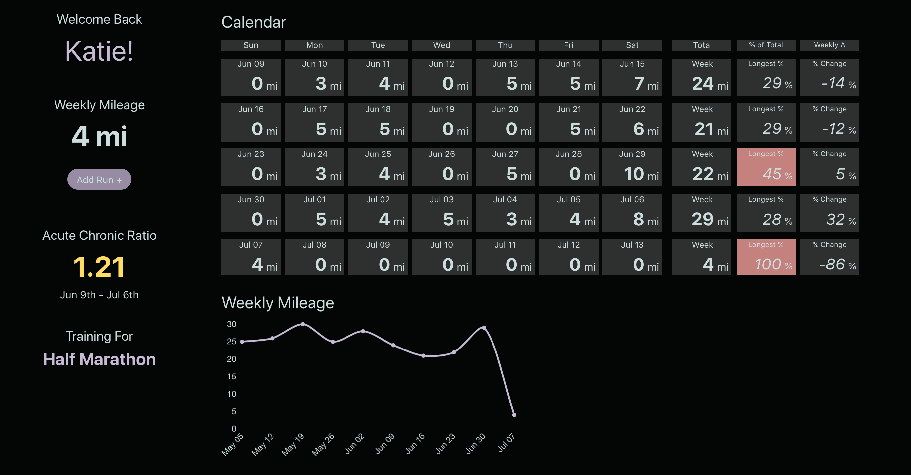
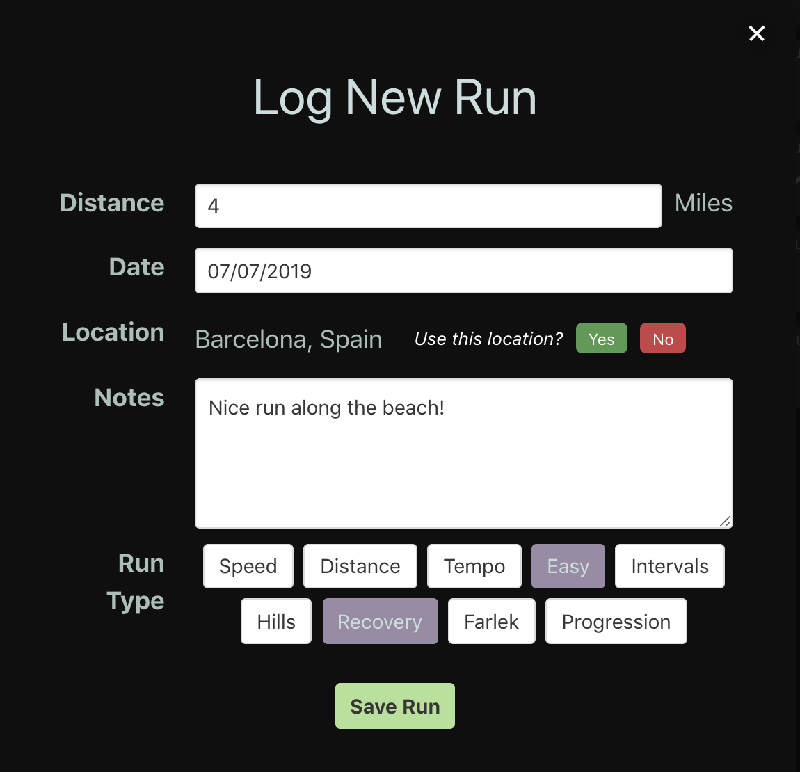
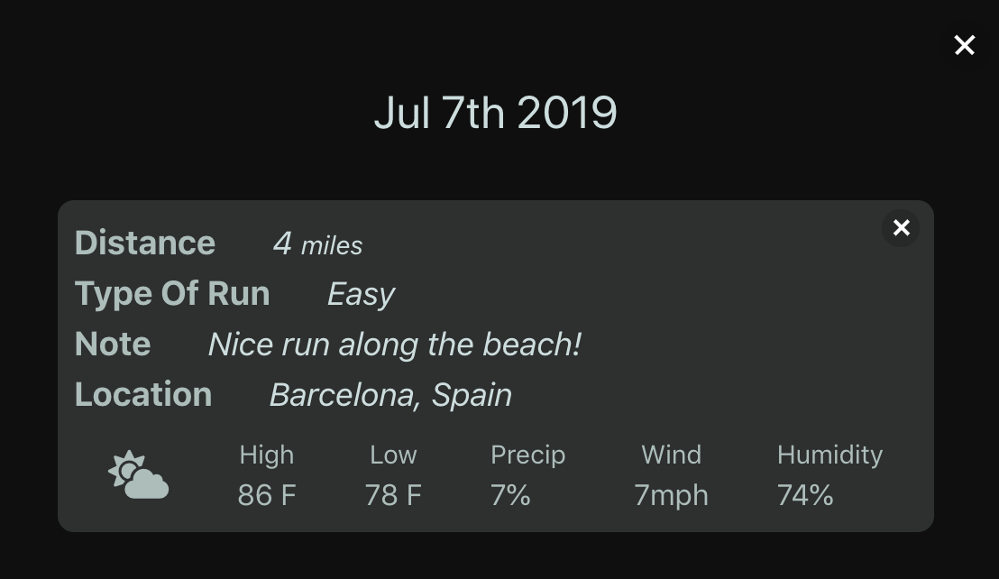

# Running Log

Running Log is a tool that leverages data analytics to help runners avoid injury. Overtraining is a common problem amongst runners, and many times it's the result of increasing mileage too quickly. With Running Log, users can record the distance they've ran, and the app will calculate whether or not they are at risk of getting hurt.

### Why is Running Log Different?

Many smart devices can track and summarize a single workout session. However, they don't quite capture performance overtime. Running Log creates an analytical dashboard based on daily runs to show weekly trends, and alert users as to whether or not they are potentially overtraining. 

Furthermore, Running Log becomes a journal for remembering specifics about a run. When logging a new workout, users have the option to indicate the type of run they went on, (speed, distance, etc.) the location, and there's a notes section for anything additional. Running Log can even provide the historical weather information, which can be very beneficial when reviewing prior performance.

## Screenshots

    
    
Summary dashboard mobile view.

    
    
Add new run mobile view.

    
    
See day details mobile view.

    
    
Summary dashboard with high level KPI's, a calendar view, and a line chart showing total distance week over week.

    
    
Logging a new run is easy. Simply indicate the distance and the date. There are optional fields as well including the location, the type of run, and any extra notes.

    
    
Click on a calendar date to reveal the day's run details. The weather will auto populate if there is a location.

## Getting Started

### Prerequesities
* MongoDB
* Location IQ API Key
* DarkSky API Key

*Note that these API keys are optional. If omitted, the application will still work, however some functionality around the location and weather will be lost.

### Installation

1. Begin by forking this repository, and cloning to your computer. 

2. Prepare a `.env` file following the examples in the folders `client` and `server`. 

3. Install the necessary dependencies.
Run `npm i` in both the `client` and `server` folders.

### To Start
Begin by starting MongoDB. For Mac users, this can be done by running `brew services start mongodb`.

To start the backend, navigate to the `server` folder and run `node index.js`. If the server has successfully started, a console log will appear in the terminal stating "Listening on port...".

To start the frontend, navigate to the `client` folder and run `npm start`. This will build the React app, and open it in the browser.

## Tech Stack

* React - frontend framework
* Redux - state management
* Express - backend framework
* MongoDb - database
* LocationIQ API - for reverse geo-coding
* DarkSky API - to gather historical weather information

